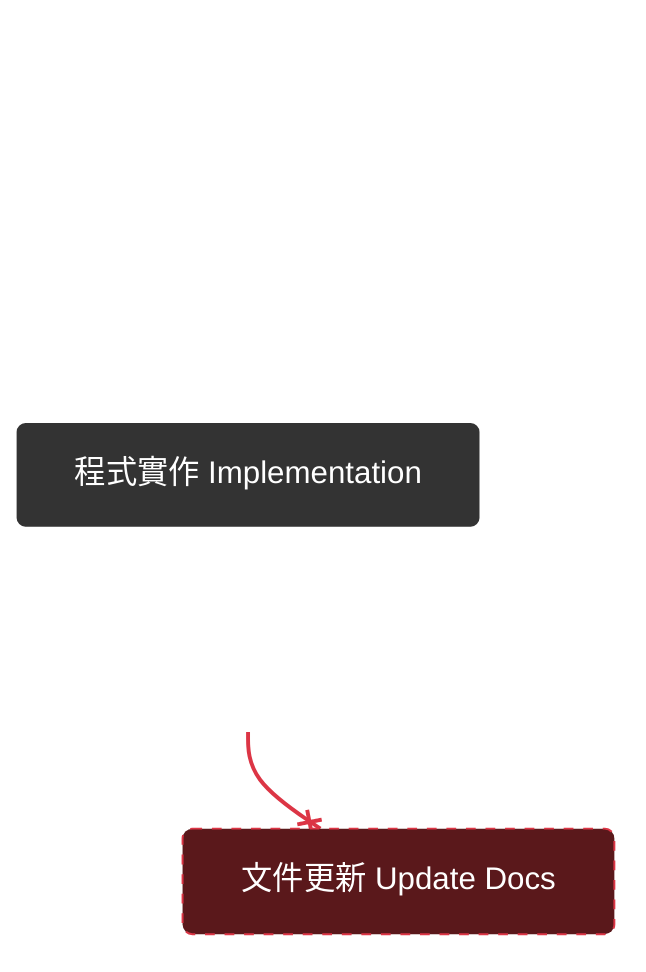
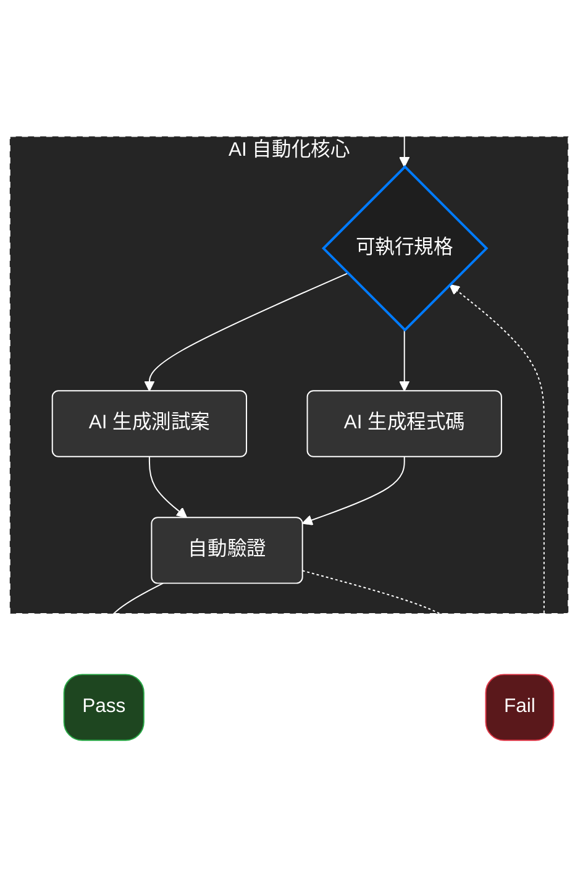

# Spec-Driven Development

一套方法論，規格先於程式，思考先於動手。<br />是一種把規格變成開發和新產物的軟體開發方法。

## 如何寫出好的描述

### 行爲導向 (When/Then/Expect)

這是源自於行為驅動開發 (BDD) 的語法，但在 SDD 裡，它被視為 AI 的母語。<br />
它讓意圖「意圖」具體化。

- When 使用者輸入密碼錯誤三次
- Then 系統鎖定帳號 5 分鐘
- Expect 鎖定期間登入嘗試應被拒絕

## 專案類型

### 綠地專案 Greenfield

指從零開始、全新開發的專案<br />
從高層需求出發，建立完整規格、計劃與可運行系統，屬於「從無到有」的建構型開發

```
Project Type: Greenfield
```

### 棕地專案 Brownfield

在既有系統或架構上進行擴充、整合或現代化的開發<br />
針對現有系統進行功能增補、架構現代化與流程調整，屬於「持續改進」或「改造型」開發

```
Project Type: Brownfield
```

## 開發流程

### 傳統開發



> 程式碼才是唯一真相

### SDD



需求輸入 -> 可執行規格 -> AI 生成測試與程式碼 -> 自動驗證與部署

> 程式碼由規格生成，更新規格即可再生實作，讓規格變成為可執行的文件

## 核心理念

- 意圖導向開發<br />
  開發者先定義意圖，做什麼(what)，再決定怎麼做(how)
- 豐富規格撰寫<br />
  結合防呆機制和組織原則
- 多步驟的精練<br />
  透過一步一步引導來產出高品質的 SDD
- **高度依賴先進 AI 模型對規格的解讀能力**<br />
  先進的模型直接影響產出的品質。

## 規格驅動開發的脈絡下，對齊的含義具體為：

- 決策對齊：規格作為開發決策的依據，確保所有變更都是基於明確的共識，而非猜測
- 行為對齊：確保所有人對系統「應該如何運作」（即規格中定義的行為）有相同的理解
- 驗收對齊：成功條件（驗收標準）被清晰定義，團隊成員知道什麼樣的結果才算完成

## 面對古蹟專案的修復

1. 看懂脈絡：釐清專案調整需求
2. 補足規格：利用 AI 工具多幾次 `/init`
3. 對齊目標：與專案參與者同步對齊目標，且以無關此次需求的程式碼就不要動為準則
4. 穩定改動：限制調整範圍，查影響半徑當作上下文來實作

## Reference

> - [規格驅動開發實戰：AI 時代的軟體開發新典範 - Will 保哥](https://learn.duotify.com/courses/sdd)
